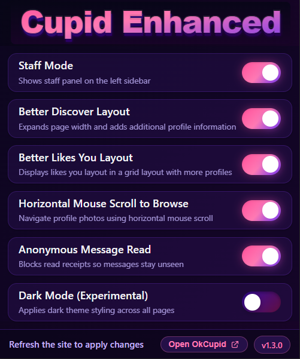

# 

  
  
  
  

  <em>Enhances the OkCupid platform for better usability and features.</em>

---

## 📚 Table of Contents

- 
  - [📚 Table of Contents](#-table-of-contents)
  - [📖 Project Overview](#-project-overview)
  - [🎯 Features](#-features)
    - [✨ Visual Enhancements](#-visual-enhancements)
    - [📈 Data \& Interface](#-data--interface)
    - [🎛️ Customization](#️-customization)
  - [⚙️ Installation](#️-installation)
    - [Prerequisites](#prerequisites)
    - [Manual Installation (Developer Mode)](#manual-installation-developer-mode)
  - [🔧 Configuration](#-configuration)
  - [📊 Usage](#-usage)
  - [📸 Screenshots](#-screenshots)
    - [Popup Page](#popup-page)
  - [🛠️ Technical Details](#️-technical-details)
    - [Technologies Used](#technologies-used)
    - [Features Implementation](#features-implementation)
  - [🗺️ Roadmap](#️-roadmap)
    - [Planned Features](#planned-features)
    - [Future Considerations](#future-considerations)
  - [🔐 Privacy and Security](#-privacy-and-security)
    - [Permissions](#permissions)
  - [❓ FAQs](#-faqs)
    - [Can I use this extension on other browsers?](#can-i-use-this-extension-on-other-browsers)
    - [Is this extension safe to use?](#is-this-extension-safe-to-use)
    - [Will using this extension get me banned?](#will-using-this-extension-get-me-banned)
    - [How do I update the extension?](#how-do-i-update-the-extension)
  - [📞 Contact](#-contact)

## 📖 Project Overview

Cupid Enhanced is a Chrome extension that enhances the OkCupid experience by unlocking hidden features, improving the user interface, and providing better control over your dating experience. Built with modern JavaScript and a beautiful dark-themed popup interface, this extension gives you the premium features you deserve.

## 🎯 Features

### 🔒 Privacy & Photos
- **👁️ Reveal Who Liked You** - View clear, unblurred profile pictures of users who liked you
- **📸 Show Full-Size Photos** - Remove height restrictions and view photos in their full glory
- **💯 Display Real Like Numbers** - See your actual like count instead of "99+"

### 🎨 Layout & Navigation
- **📐 Widen Discover Layout** - Expanded page width (90%) with better centering for larger viewing area
- **🖱️ Mouse Scroll to Browse** - Use horizontal mouse scroll to navigate through profiles
- **🚫 Hide Premium Promotions** - Clean interface without premium upgrade ads

### 🎛️ Customization
- **⚙️ Settings Popup** - Beautiful dark-themed popup with easy toggle controls for all features
- **💾 Persistent Settings** - Your preferences are saved and synced across sessions
- **🔄 Real-time Updates** - Changes apply instantly without requiring page reloads

## ⚙️ Installation

### Prerequisites

- Google Chrome or a Chromium-based browser, such as Edge or Opera.

### Manual Installation (Developer Mode)

1. Clone the repository or download the ZIP file from the [latest release](https://github.com/RL199/cupid-enhanced/releases)
2. Extract the ZIP file to a directory on your computer.
3. Open Chrome and navigate to `chrome://extensions/`.
4. Enable "Developer mode" in the top right corner.
5. Click "Load unpacked" and select the extension directory.
6. The extension icon should now appear in your Chrome toolbar.

## 🔧 Configuration

After installation, click the extension icon in your Chrome toolbar to open the settings popup. You can enable or disable any feature:

1. **Privacy & Photos** section controls image visibility and data display
2. **Layout & Navigation** section controls page layout, browsing, and ad blocking
3. All settings are saved automatically and apply immediately

## 📊 Usage

1. Navigate to [OkCupid.com](https://www.okcupid.com)
2. The extension runs automatically in the background
3. Click the extension icon to customize which features you want enabled
4. Enjoy an enhanced OkCupid experience with clearer images, real counts, and no ads!

## 📸 Screenshots

### Popup Page

The extension features a beautiful dark-themed popup with gradient colors matching the logo, providing easy access to all settings with toggle switches for each feature.

  

## 🛠️ Technical Details

### Technologies Used

- **Chrome Extension Manifest V3** - Latest extension platform
- **Vanilla JavaScript** - Pure JS with no framework dependencies
- **Chrome Storage API** - Persistent settings storage
- **Content Scripts** - DOM manipulation and API interception
- **Message Passing** - Communication between MAIN and ISOLATED worlds
- **MutationObserver API** - Dynamic DOM monitoring

### Features Implementation

**API Interception**: The extension intercepts GraphQL API responses before OkCupid processes them, allowing modification of data like image URLs and like counts.

**Response.prototype.text Override**: By overriding the native `Response.prototype.text()` method in the MAIN world, we can intercept and modify API responses seamlessly.

**Dynamic Settings**: Settings are stored using `chrome.storage.local` and synchronized in real-time between the popup, content scripts, and API interceptor using message passing.

**DOM Enhancement**: MutationObservers watch for specific elements and apply enhancements like CSS modifications, element removal (ads), and content replacement.

## 🗺️ Roadmap

### Planned Features

- **📅 Image Dates Display** ([#2](https://github.com/RL199/cupid-enhanced/issues/2)) - Show when profile photos were uploaded on the discover page
- **⏰ Likes Remaining Counter** ([#3](https://github.com/RL199/cupid-enhanced/issues/3)) - Display how many likes you have left and when the counter resets
- **🌟 Spotlight Indicator** ([#4](https://github.com/RL199/cupid-enhanced/issues/4)) - See if a user in discover page is from Spotlight
- **💝 Mutual Like Indicator** ([#5](https://github.com/RL199/cupid-enhanced/issues/5)) - See if users in discover page have already liked you

### Future Considerations

- Statistics dashboard
- Advanced filtering options
- More customization controls

## 🔐 Privacy and Security

**Your privacy is our priority.** This extension:
- ✅ Only runs on OkCupid.com domains
- ✅ Does not collect or transmit any personal data
- ✅ Does not track your browsing activity
- ✅ All processing happens locally in your browser
- ✅ Settings are stored locally using Chrome's storage API
- ✅ Open source - you can review all code

### Permissions

The extension requires the following permissions:

- **`storage`** - To save your settings preferences locally
- **`tabs`** - To communicate settings updates to active OkCupid tabs
- **Host Permission (`https://www.okcupid.com/*`)** - To run content scripts on OkCupid pages

## ❓ FAQs

### Can I use this extension on other browsers?

The extension is designed for Chrome and Chromium-based browsers (Edge, Opera, Brave, etc.). It uses Manifest V3 which is supported by all modern Chromium browsers.

### Is this extension safe to use?

Yes! The extension is completely open source and only modifies how OkCupid data is displayed to you. It doesn't collect any data or communicate with external servers. All processing happens locally in your browser.

### Will using this extension get me banned?

This extension only modifies what you see in your browser. It doesn't perform automated actions, send fake data, or violate OkCupid's terms of service in ways that would be detectable. However, use at your own discretion.

### How do I update the extension?

If installed manually, you'll need to download the latest release and reload it. Automatic updates will be available once published to the Chrome Web Store.

## 📞 Contact

For any inquiries, please contact [thisisjustadeveloper@gmail.com](mailto:thisisjustadeveloper@gmail.com).

---
